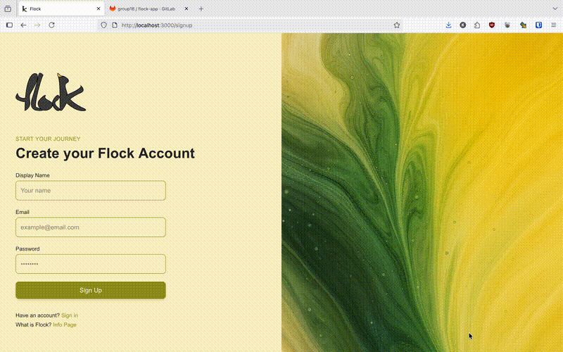
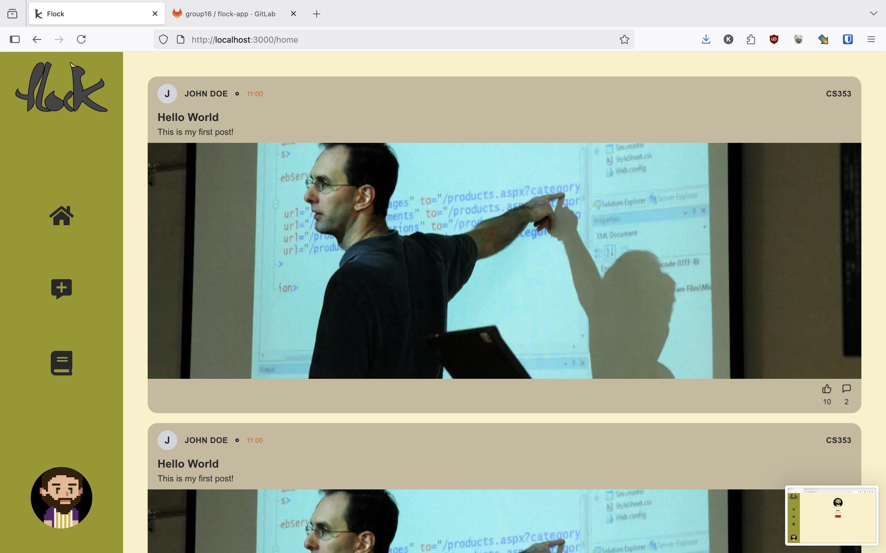
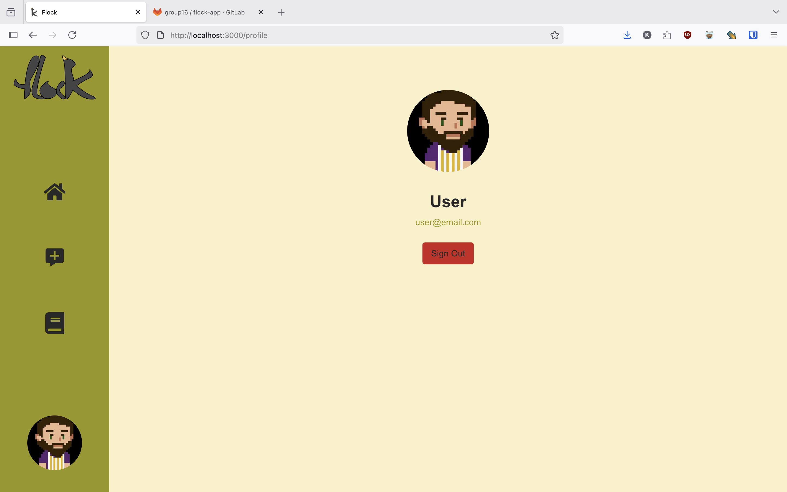
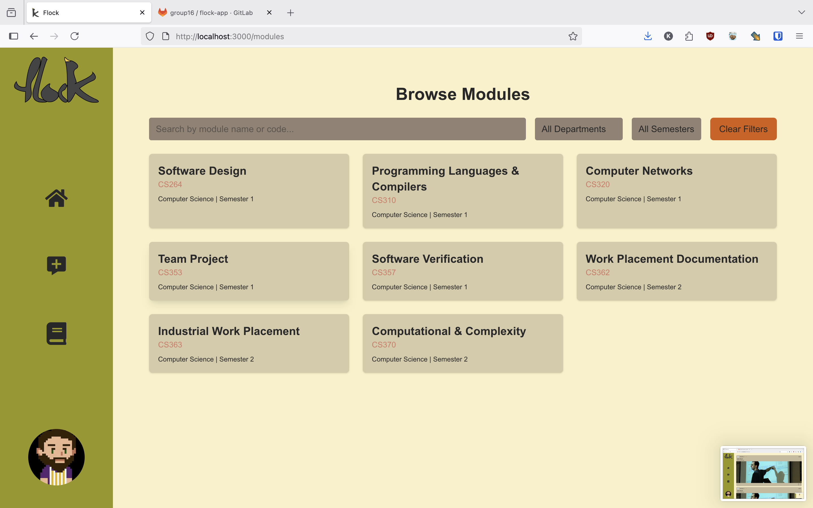
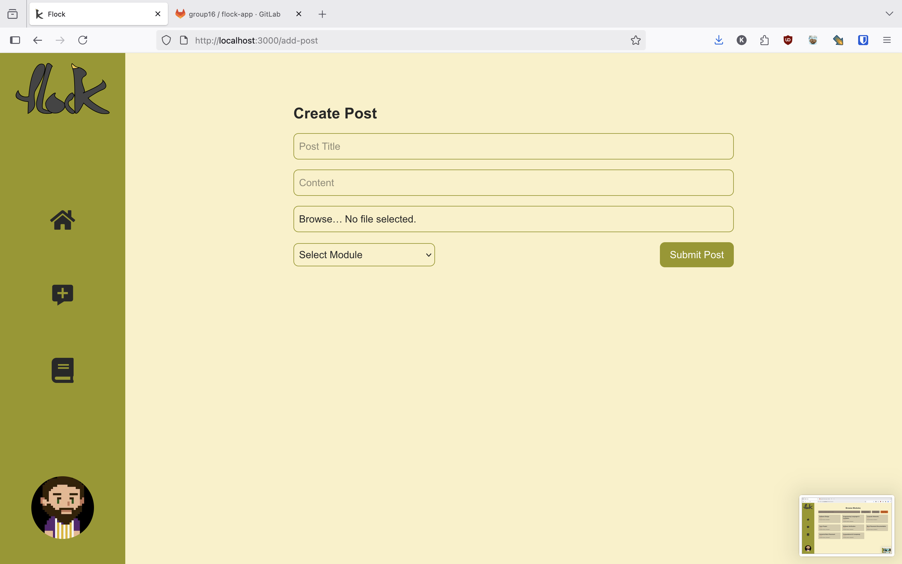
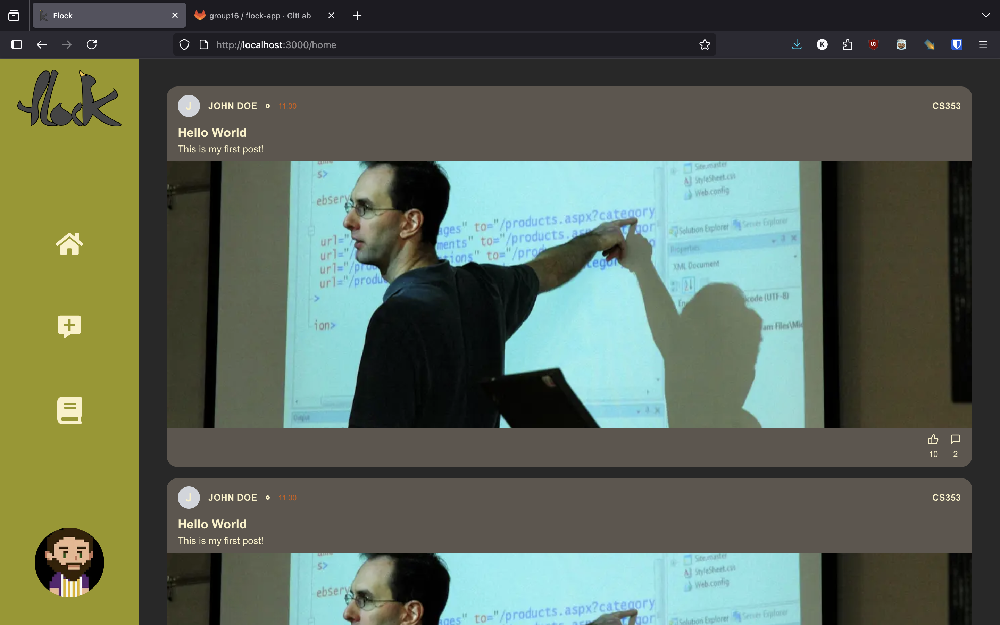
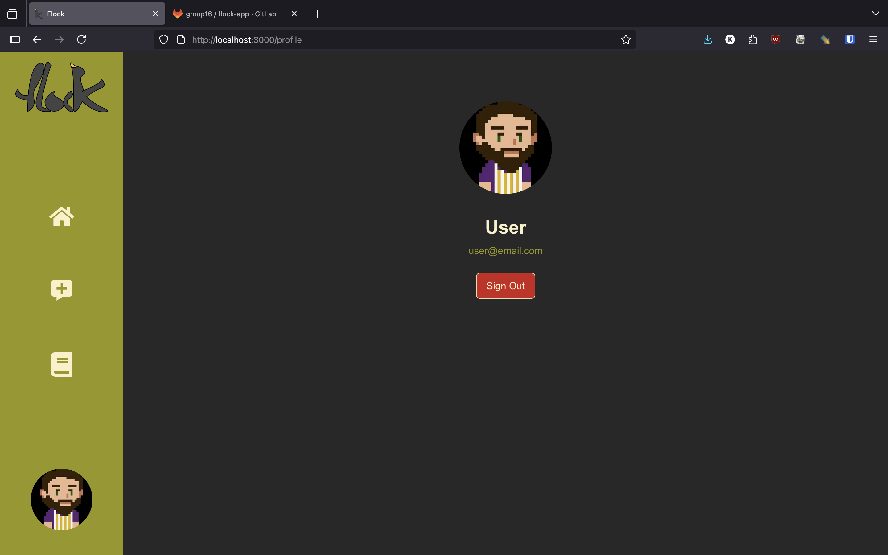
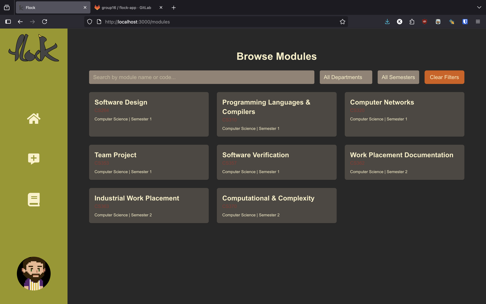

## DEMO!
This repository is an unfinished demo of a collaberative project. I took on the role of project manager for this app and was the sole editor of all documentation. The official repository is hosted on gitlab however I added a clone to my github portfolio to demonstrate my teamwork skills. 

## Flock

A social media platform for students to build relationships and collaborate.

## Collaborators

### Group 16

| Name           | Student No. | CompSci No. | Main Area  |
| -------------- | ----------- | ----------- | ---------- |
| Aayush         | -    | -  | Back-End   |
| Arran          | -   | -  | Full-Stack |
| Caitlin        | -    | -     | Front-End  |
| David-Williams | -   | -     | Back-End   |
| Kevin          | -   | -     | Front-End  |
| Reema          | -   | -     | Front-End  |
| Samuel         | -    | -   | Full-Stack |

## Screenshots
### Demo Video

### Light Mode

### Dark mode

## Technologies Used

### Frontend

Next.js, React, Typescript, TailwindCSS

### Backend

Express, Typescript, Node.js, MongoDB

### Design/Planning

Figma, Miro, Word

### Version Control/Collab

Git, GitLab

### Other

VSCode, Docker
